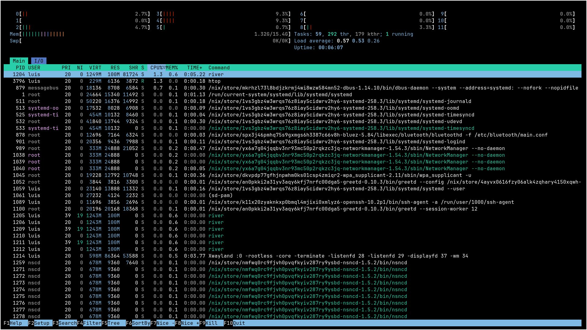

# NixConf

My personal [NixOS](https://nixos.org) configuration featuring the [River](https://github.com/riverwm/river) window manager on Wayland using [Home Manager](https://github.com/nix-community/home-manager).

## Screenshoots

<div align="center">
  
  
  
  
  
  
</div>

## System Information
| Components |  |
|---|---|
| OS | [NixOS 25.11 (Xantusia)](https://nixos.org) |
| WM | [River (wayland)](https://codeberg.org/river/river-classic) |
| Terminal | [Foot](https://codeberg.org/dnkl/foot/) |
| Shell | [Bash](https://www.gnu.org/software/bash/) |
| Editor | [Vim](https://www.vim.org/) - [NeoVim](https://neovim.io/) - [VSCodium](https://vscodium.com/) |
| File Manager | [yazi](https://github.com/sxyazi/yazi) - [Thunar](https://gitlab.xfce.org/xfce/thunar) |
| Status Bar | [waybar](https://github.com/alexays/waybar) |
| Launcher | [Wofi](https://hg.sr.ht/~scoopta/wofi) |
| Browser | [Brave](https://brave.com/) |

## Installation

### Prerequisites

- A working NixOS installation
- Git installed
- Home Manager instaled

>[!TIP]
> If you don't have Home Manager installed yet:
>
> ```sh
> bashnix-channel --add https://github.com/nix-community/home-manager/archive/release-25.11.tar.gz home-manager
> nix-channel --update
> nix-shell '<home-manager>' -A install
> ```

### Clone the Repository

- To clone without screenshots (recommended):

```sh
git clone --filter=blob:none --no-checkout https://github.com/luantorv/nixconf.git
cd nixconf
git sparse-checkout init --cone
git sparse-checkout set nixos home-manager assets/wallpapers
git checkout
```

- Or clone everything:

```sh
git clone https://github.com/luantorv/nixconf.git
cd nixconf
```

### Apply Configuration

- NixOS system configuration:

```sh
sudo cp -r nixos/* /etc/nixos/
sudo nixos-rebuild switch
```

- Home Manager configuration:

```sh
cp -r home-manager/* ~/.config/home-manager/
home-manager switch
```

- Wallpapers (optional):

```sh
mkdir -p ~/Images/Wallpapers
cp -r assets/wallpapers/* ~/Images/Wallpapers/
```

## Keybinds

You can find a guide to the keybinds used [here](https://github.com/luantorv/nixconf/blob/main/KEYBINDS.md).

## Structure

```
nixconf/
|    assets/
|    |    screenshoots/
|    |    |    foot-fastfetch.png
|    |    |    htop.png
|    |    |    nvim.png
|    |    |    waybar.png
|    |    |    wofi-clipboard.png
|    |    |    wofi-energy_menu.png
|    |    |    wofi.png
|    |    wallpapers/
|    |    |    wallhaven-0qre8q.jpg
|    |    |    wallhaven-3lwxdd.jpg
|    |    |    wallhaven-838kky.png
|    |    |    wallhaven-o5kzv7.png
|    |    |    wallhaven-x8oxez.png
|    |    |    wallhaven-zx6xyy.png
|    |    |    wallhaven-1jyjp1.png
|    |    |    wallhaven-5gpvg8.png
|    |    |    wallhaven-d6k9lj.jpg
|    |    |    wallhaven-p9qmje.jpg
|    |    |    wallhaven-x67prv.jpg
|    |    |    wallhaven-zyqwev.jpg
|    |    |    wallhaven-1p2ojg.jpg
|    |    |    wallhaven-8xmx5o.png
|    |    |    wallhaven-d6kl1j.jpg
|    |    |    wallhaven-r27pyw.jpg
|    |    |    wallhaven-x621xo.png
|    |    |    wallhaven-1pd98v.jpg
|    |    |    wallhaven-96y9qk.jpg
|    |    |    wallhaven-mdjvy8.jpg
|    |    |    wallhaven-vg8mo8.jpg
|    |    |    wallhaven-z8zkmw.jpg
|    home-manager/
|    |    modules/
|    |    |    bash.nix
|    |    |    btop.nix
|    |    |    cliphist.nix
|    |    |    colors.nix
|    |    |    foot.nix
|    |    |    gtk.nix
|    |    |    home-manager.nix
|    |    |    kanshi.nix
|    |    |    mako.nix
|    |    |    nvim.nix
|    |    |    packages.nix
|    |    |    river.nix
|    |    |    starship.nix
|    |    |    swappy.nix
|    |    |    swaylock.nix
|    |    |    udiskie.nix
|    |    |    variables.nix
|    |    |    vim.nix
|    |    |    waybar.nix
|    |    |    wofi.nix
|    |    |    yazi.nix
|    |    scripts/
|    |    |    gen-mt.sh
|    |    |    wallpaper_cycle.sh
|    |    home.nix
|    |    nixoslogo.png
|    nixos/
|    |    modules/
|    |    |    boot.nix
|    |    |    disk.nix
|    |    |    networking.nix
|    |    |    nix.nix
|    |    |    packages.nix
|    |    |    security.nix
|    |    |    services.nix
|    |    |    users.nix
|    |    |    variables.nix
|    |    configuration.nix
|    KEYBINDS.md
|    README.md
```

## Credits

All wallpapers available in [wallpapers](https://github.com/luantorv/nixconf/tree/main/assets/wallpapers/) were extracted from [wallhaven](https://wallhaven.cc).

The wallpapers in this repository are the property of their respective authors. I do not claim ownership of any artwork shared here.

If you recognize any of these works and know the original artist, or if you are the creator of an image and would like it to be specifically credited (or removed), please reach out directly via any of my [contact methods](#author)

The image for [swaylock-effects](https://github.com/jirutka/swaylock-effects) were extracted from [nixos-artwork GitHub repository](https://github.com/NixOS/nixos-artwork/blob/master/wallpapers/nix-wallpaper-gear.png).

## Disclaimer

This project is primarily designed for personal use.
Feel free to adapt it, fork it, or break it.

## Author:

- [GitHub](https://github.com/luantorv/)
- [Discord](https://discord.com/users/711613864386625618)
