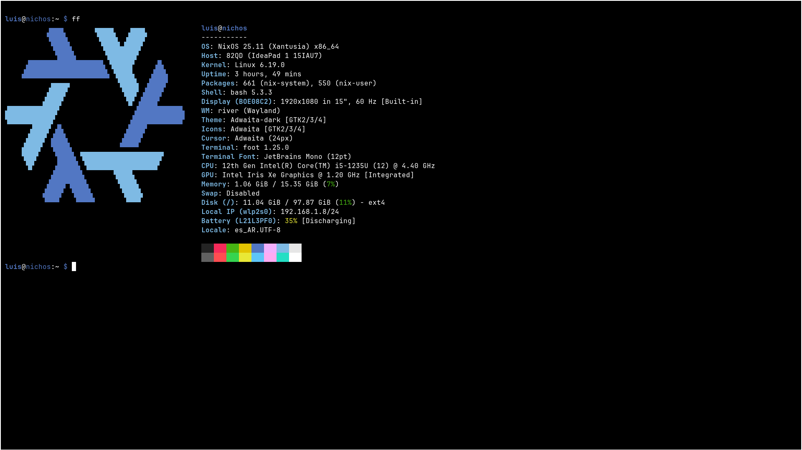
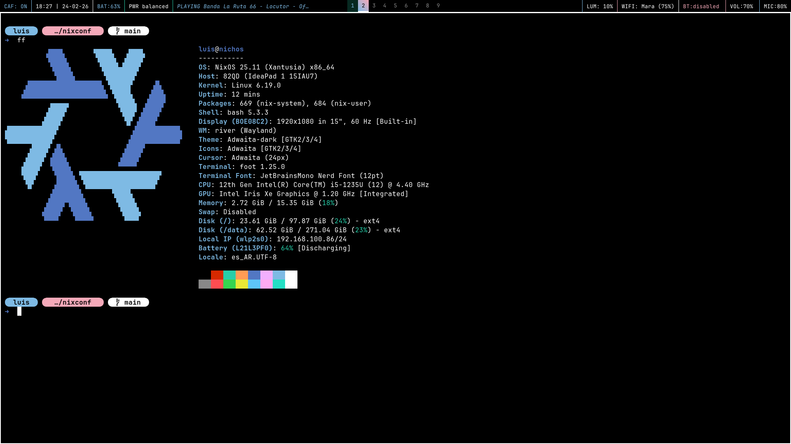
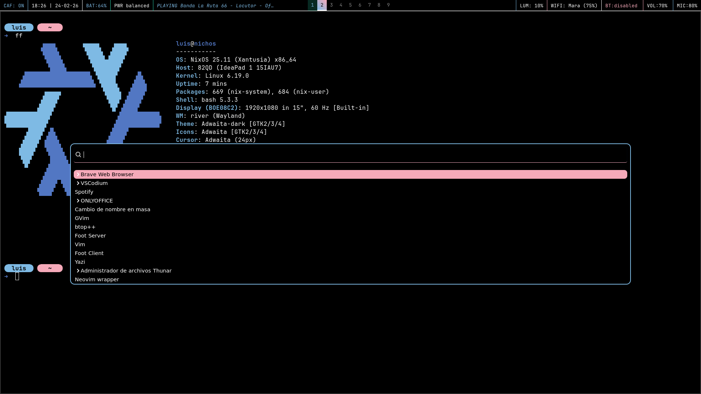
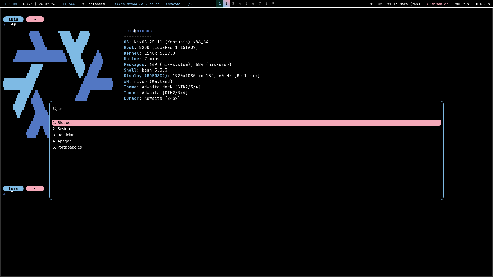
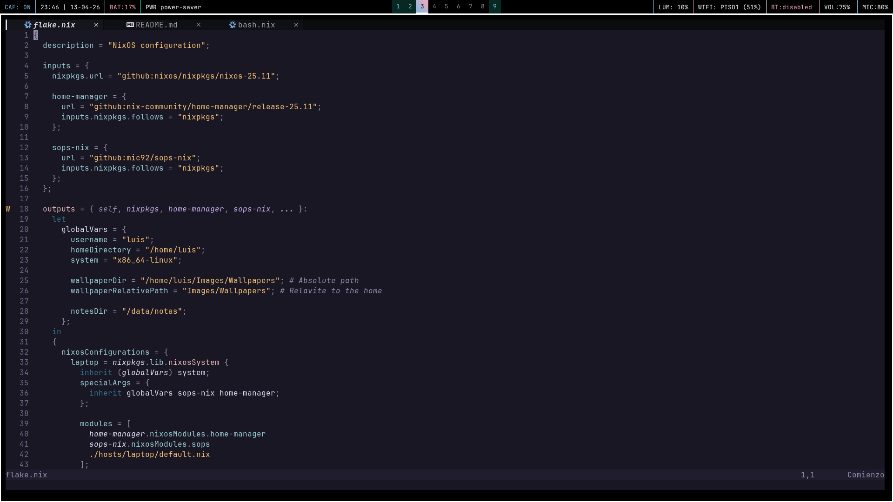
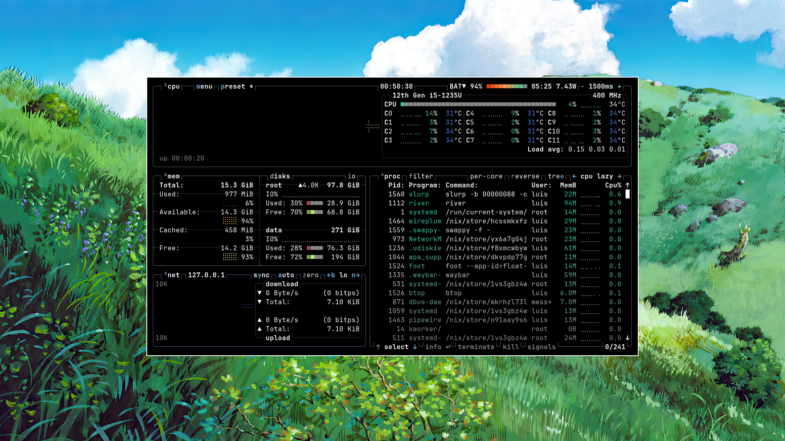

# NixConf

My personal [NixOS](https://nixos.org) configuration featuring the [River](https://github.com/riverwm/river) window manager on Wayland using [Home Manager](https://github.com/nix-community/home-manager).


## Structure

```sh
.
├── assets/            # Wallpapers and screenshots
├── docs/              # Configuration documentation
│   ├── KEYBINDS.md
│   └── SECRETS.md
├── flake.nix          # Entry point, global variables
├── hosts/             # Per-machine configuration
│   ├── laptop/
│   │   ├── default.nix
│   │   ├── boot.nix
│   │   ├── hardware-configuration.nix
│   │   └── hardware.nix
│   └── server/
│       ├── default.nix
│       ├── boot.nix
│       ├── hardware-configuration.nix
│       └── harwdare.nix
├── modules/
│   ├── home/          # Home Manager modules
│   │   ├── desktop/
│   │   ├── editors/
│   │   ├── files/
│   │   ├── packages/
│   │   ├── shell/
│   │   ├── terminal/
│   │   └── theme/
│   └── nixos/         # NixOS modules
│       ├── boot/
│       └── core/
├── profiles/          # Module bundles per use case
│   ├── desktop.nix
│   └── minimal.nix
├── secrets/           # Secrets handled by SOPS
├── shells/            # Nix dev shells
└── README.md
```

## Screenshoots

<div align="center">
  
  
  
  
  
  
</div>

## System Information
| Components |  |
|---|---|
| OS | [NixOS 25.11 (Xantusia)](https://nixos.org) |
| WM | [River (wayland)](https://codeberg.org/river/river-classic) |
| Terminal | [Foot](https://codeberg.org/dnkl/foot/) |
| Shell | [Bash](https://www.gnu.org/software/bash/) |
| Editor | [Vim](https://www.vim.org/) - [NeoVim](https://neovim.io/) - [VSCodium](https://vscodium.com/) |
| File Manager | [yazi](https://github.com/sxyazi/yazi) - [Thunar](https://gitlab.xfce.org/xfce/thunar) |
| Status Bar | [waybar](https://github.com/alexays/waybar) |
| Launcher | [Wofi](https://hg.sr.ht/~scoopta/wofi) |
| Browser | [Brave](https://brave.com/) |

## Installation

### Prerequisites

All three scenarios assume you have booted into a NixOS live environment or an existing NixOS system. The configuration uses flakes, so nix with flakes support is required throughout.

If your current nix version does not have flakes enabled, add this flag to every nix command used below:

```
--extra-experimental-features 'nix-command flakes'
```

Or enable it permanently in your current session:

```bash
export NIX_CONFIG="experimental-features = nix-command flakes"
```

#### 1. Fresh NixOS install (post-installer)

This assumes you have just finished partitioning and mounting your drives and have generated a `hardware-configuration.nix` via `nixos-generate-config`.

- Clone the repository

```bash
git clone https://github.com/luantorv/nixconf.git /mnt/etc/nixos
cd /mnt/etc/nixos
```

- Copy your hardware configuration

```bash
cp /etc/nixos/hardware-configuration.nix hosts/laptop/hardware-configuration.nix
```

- Adjust global variables

Edit `flake.nix` and set your username and home directory:

```nix
globalVars = {
  username              = "youruser";
  homeDirectory         = "/home/youruser";
  system                = "x86_64-linux";
  wallpaperDir          = "/home/youruser/Images/Wallpapers"; # Absolute path
  wallpaperRelativePath = "Images/Wallpapers"; # Relavite to the home
};
```

- Install

```bash
nixos-install --flake /mnt/etc/nixos#laptop
```

- Reboot

```bash
reboot
```

After rebooting, the repository will be at `/etc/nixos`. Future rebuilds are done from there.

#### 2. Applying to an existing NixOS system

This assumes NixOS is already running and you want to replace your current configuration with this one.

- Clone the repository

```bash
git clone https://github.com/luantorv/nixconf.git ~/nixconf
cd ~/nixconf
```

- Copy your hardware configuration

```bash
cp /etc/nixos/hardware-configuration.nix hosts/laptop/hardware-configuration.nix
```

- Adjust global variables

Edit `flake.nix` and set your username and home directory:

```nix
globalVars = {
  username              = "youruser";
  homeDirectory         = "/home/youruser";
  system                = "x86_64-linux";
  wallpaperDir          = "/home/youruser/Images/Wallpapers"; # Absolute path
  wallpaperRelativePath = "Images/Wallpapers"; # Relavite to the home
};
```

- Apply

```bash
sudo nixos-rebuild switch --flake .#laptop
```

- (Optional) Move to `/etc/nixos`

If you want the configuration to live in the conventional location:

```bash
sudo mv ~/nixconf /etc/nixos
```

Future rebuilds:

```bash
cd /etc/nixos && sudo nixos-rebuild switch --flake .#laptop
```

#### 3. Home Manager only (without managing the system)

This scenario applies if you are running NixOS (or another Linux distribution) and only want to manage your user environment, without this flake touching system-level configuration.

>[!NOTE] 
> This configuration uses Home Manager as a NixOS module. Running it standalone requires minor adjustments. See the note at the end of this section.

- Install Home Manager (standalone)

```bash
nix run home-manager/master -- init --switch
```

- Clone the repository

```bash
git clone https://github.com/luantorv/nixconf.git ~/nixconf
cd ~/nixconf
```

- Adjust global variables

Edit `flake.nix` and set your username and home directory.

- Apply

```bash
home-manager switch --flake .#youruser
```

> This requires adding a homeConfigurations output to `flake.nix` that points directly to the desired profile's home modules, since the standalone mode does not go through `nixosModules.home-manager`. The system-level modules (`modules/nixos/`) will have no effect in this scenario.

## Updating

- Pull the latest changes and rebuild:

```bash
git pull
sudo nixos-rebuild switch --flake .#laptop
```

To update flake inputs (nixpkgs, home-manager, etc.) before rebuilding:

```bash
nix flake update
sudo nixos-rebuild switch --flake .#laptop
```

## Dev Shells

Project-specific development environments are available under `shells/`. Enter one with:

```bash
nix develop ~/nixconf#default
nix develop ~/nixconf#python
nix develop ~/nixconf#node
nix develop ~/nixconf#rust
nix develop ~/nixconf#latex
```

Running `nix develop` without a target drops you into the default shell.


## Keybinds

You can find a guide to the keybinds used in river [here](https://github.com/luantorv/nixconf/blob/main/docs/KEYBINDS.md).


## Credits

All wallpapers available in [wallpapers](https://github.com/luantorv/nixconf/tree/main/assets/wallpapers/) were extracted from [wallhaven](https://wallhaven.cc).

The wallpapers in this repository are the property of their respective authors. I do not claim ownership of any artwork shared here.

If you recognize any of these works and know the original artist, or if you are the creator of an image and would like it to be specifically credited (or removed), please reach out directly via any of my [contact methods](#author)

The image for [swaylock-effects](https://github.com/jirutka/swaylock-effects) were extracted from [nixos-artwork GitHub repository](https://github.com/NixOS/nixos-artwork/blob/master/wallpapers/nix-wallpaper-gear.png).

## Disclaimer

This project is primarily designed for personal use.
Feel free to adapt it, fork it, or break it.

## Author:

- [GitHub](https://github.com/luantorv/)
- [Discord](https://discord.com/users/711613864386625618)
